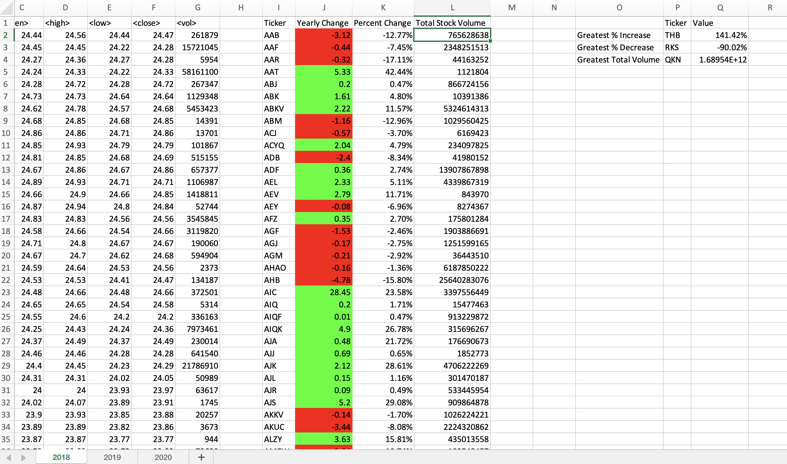
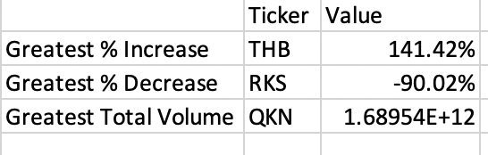
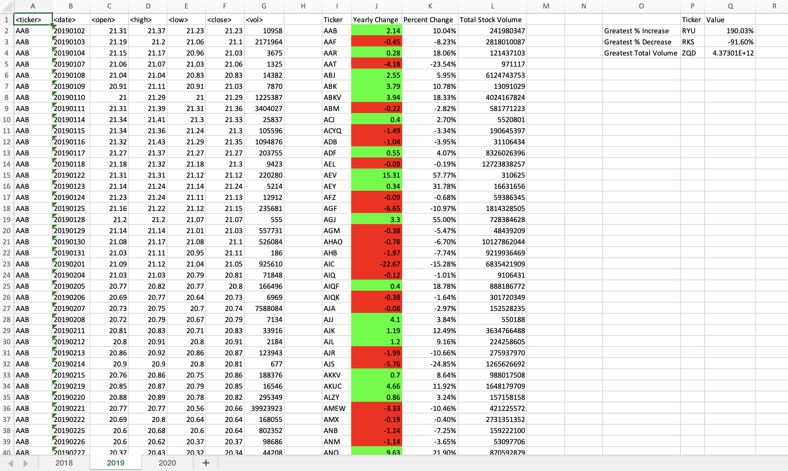
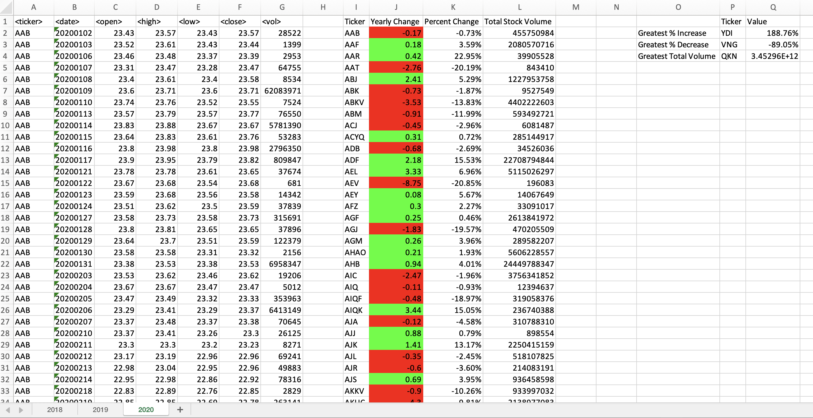

## Wallstreet Stock Insights 

Analyzes Political and Financial Data using Python 

## Objectives

### Step 1 - Stock Outputs 

* Create a script that loops through all the stocks for one year (2018) and outputs the following information:
    * The ticker symbol
    * Yearly change from the opening price at the beginning of a given year to the closing price at the end of that year
    * The percentage change from the opening price at the beginning of a given year to the closing price at the end of that year
    * The total stock volume of the stock

### Step 2 - Add Functionality

* Add functionality to your script to return the stock with the "Greatest % increase", "Greatest % decrease", and "Greatest total volume"

### Step 3 - Multiple Years

* Make the appropriate adjustments to the VBA script to enable it to run on every worksheet (every year) at once
    * 2019

    * 2020

---------------------------------------------------

<b>Contact:</b> bronwynmilne64@gmail.com
